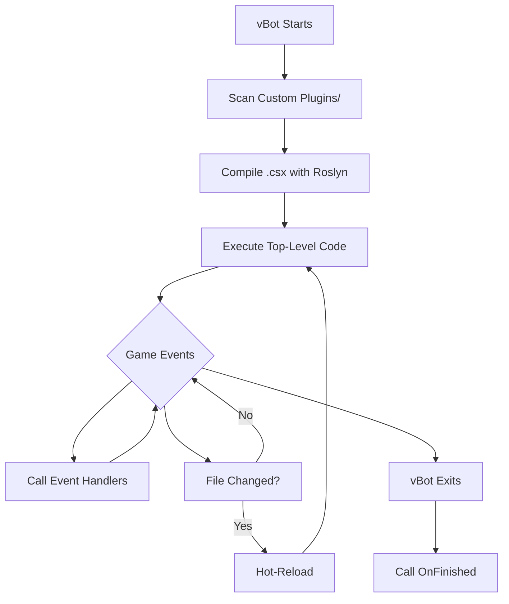

# vBot Scripting API Reference

> Create custom plugins for vBot using C# scripts (`.csx`). Scripts are compiled by Roslyn (.NET 8.0) and run directly — no build step needed.

---

## Table of Contents

1. [Overview](#1-overview)
2. [Getting Started](#2-getting-started)
3. [Script Lifecycle](#3-script-lifecycle)
4. [Events](#4-events)
5. [Log](#5-log)
6. [Player](#6-player)
6.5. [Autowalk (Pathfinding)](#65-autowalk-pathfinding)
7. [Inventory](#7-inventory)
8. [World](#8-world)
9. [Chat](#9-chat)
10. [Bot](#10-bot)
11. [Party](#11-party)
12. [Config](#12-config)
13. [Packets](#13-packets)
14. [GUI](#14-gui)
15. [GameInfo](#15-gameinfo)
16. [Skills](#16-skills)
16.5. [SkillReloadApi](#165-reloading-skills-from-config-skillreloadapi)
16.6. [Buffing](#166-buffing)
16.7. [Masteries](#167-masteries)
17. [Pets](#17-pets)
18. [Quests](#18-quests)
19. [Storage](#19-storage)
20. [Hot-Reload](#20-hot-reload)
20.5. [Script Commands (IScriptCommand)](#205-script-commands-iscriptcommand)
21. [xControl Plugin](#21-xcontrol-plugin)
22. [Examples](#22-complete-examples)
23. [Performance & Memory](#23-performance--memory)

---

## 1. Overview

### Architecture

```
┌─────────────────────────────────────────────────────────────┐
│                         vBot Core                           │
│                    (C# Application)                         │
├─────────────────────────────────────────────────────────────┤
│              Roslyn C# Script Engine (.NET 8.0)             │
├─────────────────────────────────────────────────────────────┤
│  ┌─────────────┐ ┌─────────────┐ ┌─────────────┐           │
│  │ plugin1.csx │ │ plugin2.csx │ │ plugin3.csx │  ...      │
│  └─────────────┘ └─────────────┘ └─────────────┘           │
└─────────────────────────────────────────────────────────────┘
```

### Scripts Folder

```
vBot/
├── vBot.exe
├── Custom Plugins/           ← Put your .csx scripts here
│   ├── my_plugin.csx
│   └── ...
└── Core/Library/vBot.Scripting/
```

> [!IMPORTANT]
> All scripts must be placed in the **`Custom Plugins`** folder with a **`.csx`** extension.

---

## 2. Getting Started

### First Script

Create `Custom Plugins/hello.csx`:

```csharp
Log.Info("Hello from script!");

OnJoinedGame += () => {
    Log.Info($"Welcome {Player.Name}! Level {Player.Level}, HP {Player.HPPercent}%");
};

OnFinished += () => {
    Log.Info("Script unloaded!");
};
```

### Script Template

```csharp
// ── Top-level code (runs on load) ──
Log.Info("MyPlugin loaded!");

// ── Event handlers (called later) ──
OnJoinedGame += () => { /* character enters game */ };
OnTick += () => { /* every 500ms while in game */ };
OnFinished += () => { /* script unloading — cleanup here */ };
```

### Auto-Imported Namespaces

```csharp
using System;
using System.Collections.Generic;
using System.Linq;
using System.IO;
using System.Threading.Tasks;
using vBot.Scripting.API;  // Log, Player, Inventory, World, Chat, Bot, Config, Packets, GUI, Party
```

---

## 3. Script Lifecycle



| State | Meaning |
|-------|---------|
| **Loading** | Being compiled |
| **Loaded** | Running |
| **CompileError** | Syntax errors |
| **RuntimeError** | Crashed during execution |

---

## 4. Events

### Event List

| Event | Signature | Trigger |
|-------|-----------|---------|
| `OnJoinedGame` | `Action` | Character enters game |
| `OnConnected` | `Action` | Connected to server |
| `OnDisconnected` | `Action` | Disconnected |
| `OnTeleported` | `Action` | After teleport |
| `OnTick` | `Action` | Every 500ms while in game |
| `OnBotStart` | `Action` | Bot starts |
| `OnBotStop` | `Action` | Bot stops |
| `OnLevelUp` | `Action` | Player levels up |
| `OnDeath` | `Action` | Player dies |
| `OnRespawn` | `Action` | Player respawns |
| `OnChatMessage` | `Action<int, string, string>` | Chat received — `(type, sender, message)` |
| `OnEntitySpawn` | `Action<uint, string, int, int, bool>` | Entity spawns — `(uniqueId, name, entityType, jobType, isJobActive)` |
| `OnEntityDespawn` | `Action<uint>` | Entity despawns — `(uniqueId)` |
| `OnUniqueSpawn` | `Action<string, int>` | Unique boss spawn announced — `(name, modelId)` |
| `OnUniqueKilled` | `Action<string, int>` | Unique boss kill announced — `(name, modelId)` |
| `OnItemPickup` | `Action<string, int, bool>` | Item picked up — `(name, amount, isRare)` |
| `OnInventoryUpdate` | `Action` | Inventory changed |
| `OnGoldPickup` | `Action<int>` | Gold picked up — `(amount)` |
| `OnExpGained` | `Action<long>` | EXP gained — `(amount)` |
| `OnSkillExpGained` | `Action<long>` | Skill EXP gained — `(amount)` |
| `OnPartyInvite` | `Action<string>` | Party invite — `(senderName)` |
| `OnPetSummoned` | `Action<string>` | Pet summoned — `(petType)` |
| `OnPetDied` | `Action<string>` | Pet died/unsummoned — `(petType)` |
| `OnBuffAdded` | `Action<uint, string>` | Buff added — `(skillId, name)` |
| `OnBuffRemoved` | `Action<uint, string>` | Buff removed — `(skillId, name)` |
| `OnRegionChange` | `Action<ushort>` | New region — `(regionId)` |
| `OnPlayerAttack` | `Action<string, uint>` | Attacked by another player skill — `(name, id)` |
| `OnCTFTeamAssigned` | `Action<byte>` | CTF team set — `(team)` where 0=Red, 1=Blue |
| `OnHotReloaded` | `Action` | Script re-loaded while in-game (Ctrl+S). Does NOT fire on initial load. |
| `OnFinished` | `Action` | Script unloading |

### Example

```csharp
OnChatMessage += (type, sender, message) => {
    // type: 1=all, 2=private, 4=party, 5=guild, 6=global, 7=notice
    Log.Info($"[{type}] {sender}: {message}");
};

OnEntitySpawn += (uniqueId, name, entityType, jobType, isJobActive) => {
    // entityType: 0=Player, 1=NPC, 2=Monster, 3=Item
    // jobType: 0=None, 1=Hunter, 2=Trader, 3=Thief (registered guild role)
    // isJobActive: true only when actively wearing a job suit
    if (entityType == 2) Log.Info($"Monster spawned: {name}");
    if (entityType == 0 && isJobActive) Log.Warn($"Active job player nearby: {name}");
};

OnUniqueSpawn += (name, modelId) => {
    var monster = World.GetAliveMonsters()
        .FirstOrDefault(m => m.ModelId == (uint)modelId && m.IsUnique);

    var hpText = monster != null ? $" HP {monster.HPPercent}%" : " HP unknown";

    Log.Warn($"[Unique] {name} has spawned!");
    Chat.Party($"Unique spawned: {name}!{hpText}");
};

OnUniqueKilled += (name, modelId) => Log.Info($"[Unique] {name} was killed.");

OnItemPickup += (itemName, amount, isRare) => {
    var rarity = isRare ? "rare/blue" : "normal";
    Log.Info($"Picked up {rarity}: {itemName} x{amount}");
};
OnExpGained += (amount) => Log.Info($"+{amount} EXP");
OnBuffAdded += (skillId, name) => Log.Info($"Buff: {name} (ID:{skillId})");
OnPlayerAttack += (name, id) => Log.Warn($"Under attack by {name}!");
OnDeath += () => Log.Warn("Character died");
OnPetDied += (petType) => Log.Warn($"Pet/transport ended: {petType}");
```

### Chat Type IDs

| ID | Channel |
|----|---------|
| 1 | All (public) |
| 2 | Private |
| 3 | All GM |
| 4 | Party |
| 5 | Guild |
| 6 | Global |
| 7 | Notice |
| 9 | Stall |
| 11 | Union |
| 16 | Academy |

### Entity and Item Event Notes

`OnEntitySpawn` now includes `jobType` and `isJobActive` for player spawns:

| jobType | Meaning |
|---------|---------|
| 0 | None/normal player |
| 1 | Hunter |
| 2 | Trader |
| 3 | Thief |

`isJobActive` is `true` only when the player is **actively wearing a job suit** during the spawn. `jobType` reflects their registered guild role regardless of whether they are on a job run.

`OnUniqueSpawn` fires when the server broadcasts a unique (boss) monster appearance to the map. `OnUniqueKilled` fires when the kill is broadcast. Both carry the monster's display `name` and reference `modelId`.

`OnUniqueSpawn` is a server-wide announcement. `MonsterInfo.HPPercent` is only available when that unique is also spawned near your character and visible in `World.GetAliveMonsters()`. If it is not visible, show `HP unknown`.

`OnItemPickup` now includes `isRare`. This is `true` for blue/rare-or-better item records and `false` for normal white items.

`OnPetDied` can report these values: `Growth`, `Fellow`, `Ability`, `Vehicle`, `JobTransport`, or `Cos` when the exact COS type cannot be resolved.

`World.GetMonstersByName(name)` returns `MonsterInfo` objects. `MonsterInfo.IsUnique` is `true` for Unique, Unique2, UniqueParty, and Unique2Party rarities. Use `MonsterInfo.HPPercent` for monster HP percent and `MonsterInfo.MaxHealth` for maximum HP.

---

## 5. Log

| Function | Description |
|----------|-------------|
| `Log.Info(msg)` | Info message (white) |
| `Log.Warn(msg)` | Warning (yellow) |
| `Log.Error(msg)` | Error (red) |
| `Log.Debug(msg)` | Debug (gray) |
| `Log.Status(msg)` | Update status bar text |

```csharp
Log.Info($"Player {Player.Name} is level {Player.Level}");
Log.Warn("Low HP!");
Log.Status("Farming...");
```

---

## 6. Player

### Properties

| Property | Type | Description |
|----------|------|-------------|
| `Player.Name` | `string` | Character name |
| `Player.Level` | `int` | Level |
| `Player.HP` / `MaxHP` | `int` | Current / max HP |
| `Player.MP` / `MaxMP` | `int` | Current / max MP |
| `Player.HPPercent` | `int` | HP % (0–100) |
| `Player.MPPercent` | `int` | MP % (0–100) |
| `Player.Gold` | `ulong` | Gold |
| `Player.Experience` | `long` | EXP |
| `Player.SkillPoints` | `uint` | Available skill points |
| `Player.SkillExperience` | `uint` | Skill EXP |
| `Player.StatPoints` | `ushort` | Available stat points |
| `Player.MaxLevel` | `int` | Max level cap |
| `Player.IsDead` | `bool` | Dead? |
| `Player.UniqueId` | `uint` | Unique ID |

### Combat Stats

| Property | Type | Description |
|----------|------|-------------|
| `Player.Strength` | `int` | STR |
| `Player.Intelligence` | `int` | INT |
| `Player.PhysicalAttackMin` / `Max` | `uint` | Physical ATK range |
| `Player.MagicalAttackMin` / `Max` | `uint` | Magical ATK range |
| `Player.PhysicalDefense` | `int` | Physical DEF |
| `Player.MagicalDefense` | `int` | Magical DEF |
| `Player.HitRate` | `int` | Hit rate |
| `Player.ParryRate` | `int` | Parry rate |

### State

| Property | Type | Description |
|----------|------|-------------|
| `Player.InCombat` | `bool` | In combat? |
| `Player.InAction` | `bool` | Casting/acting? |
| `Player.CanAttack` | `bool` | Can attack? |
| `Player.IsMounted` | `bool` | On transport? |
| `Player.IsBerzerking` | `bool` | Berzerk mode? |
| `Player.BerzerkPoints` | `int` | HWAN gauge (0–5) |
| `Player.CanBerzerk` | `bool` | Can berzerk? |
| `Player.IsExchanging` | `bool` | Exchanging items? |
| `Player.DailyPK` / `TotalPK` | `int` | PK counts |
| `Player.PKPenaltyPoints` | `uint` | PK penalty |
| `Player.IsInDungeon` | `bool` | In dungeon? |
| `Player.IsGameMaster` | `bool` | Is GM? |
| `Player.GuildName` | `string` | Guild name |
| `Player.TargetId` | `uint` | Selected entity's runtime UID (falls back to combat target). **Use in server packets.** `0` = none. |
| `Player.SelectedEntityId` | `uint` | UI-selected entity only (no combat fallback). `0` = none. |

### Position

| Property | Type | Description |
|----------|------|-------------|
| `Player.RegionId` | `ushort` | Current region |
| `Player.X` / `Y` | `float` | World coordinates |
| `Player.Z` | `float` | Height |
| `Player.XOffset` / `YOffset` | `float` | Sector offsets |

### Actions

| Method | Returns | Description |
|--------|---------|-------------|
| `Player.MoveTo(x, y)` | `bool` | **Single straight-line step** to a nearby point. Sends one walk packet (`0x7021`), **capped at 150 game units** and with **no pathfinding**: returns `false` if the target is farther or the player is mid-cast. For longer or obstacle-blocked routes use `Player.WalkTo` (see [Autowalk](#65-autowalk-pathfinding)). |
| `Player.WalkTo(x, y)` | `bool` | **Pathfinding autowalk** to a world position in the current region (same engine as the Training tab "Walk" button). Routes around obstacles, no distance limit. Non-blocking, so poll `IsWalking`. See [Autowalk](#65-autowalk-pathfinding). |
| `Player.WalkTo(regionId, x, y, z)` | `bool` | Pathfinding autowalk to an explicit position, including **cross-region** travel (auto-routes through gates/teleports). |
| `Player.StopWalk()` | `void` | Cancel an autowalk started by `WalkTo`. |
| `Player.IsWalking` | `bool` | `true` while a `WalkTo` autowalk is in progress. |
| `Player.UseReturnScroll()` | `bool` | Use return scroll |
| `Player.UseHealthPotion()` | `void` | Use HP potion |
| `Player.UseManaPotion()` | `void` | Use MP potion |
| `Player.EnterBerzerk()` | `bool` | Enter berzerk mode |
| `Player.UseVigorPotion()` | `bool` | Use vigor potion |
| `Player.UseUniversalPill()` | `bool` | Cure debuffs |
| `Player.UsePurificationPill()` | `bool` | Use purification pill |
| `Player.EquipAmmunition()` | `void` | Auto-equip ammo |
| `Player.AmmunitionCount` | `int` | Current ammo count |
| `Player.GetData()` | `Dictionary<string, object>` | All player data as dictionary |

### Trace (Follow Player)

| Method / Property | Returns | Description |
|-------------------|---------|-------------|
| `Player.StartTrace(name)` | `void` | Follow a nearby player |
| `Player.StopTrace()` | `void` | Stop following |
| `Player.IsTracing` | `bool` | Currently following? |
| `Player.TracingPlayer` | `string` | Name of followed player |

### 6.5 Autowalk (Pathfinding)

> Move the character to a destination with **full pathfinding** using the same NavMesh engine behind the Training tab "Walk" button. This is what you want for "go to these coordinates": it routes around obstacles, has **no distance limit**, and can travel **across regions** (auto-routing through town gates and teleports). It works **without starting the bot** and regardless of which botbase is loaded.

#### `MoveTo` vs `WalkTo`: which to use?

| | `Player.MoveTo(x, y)` | `Player.WalkTo(x, y)` |
|---|---|---|
| Pathfinding | ❌ straight line only | ✅ routes around obstacles |
| Max distance | **150 game units** | unlimited |
| Cross-region | ❌ | ✅ (`WalkTo(regionId, x, y, z)`) |
| Blocking | sends one packet | non-blocking, runs in background |
| Use when | nudging one step on-screen | "walk to this point/town" |

> [!IMPORTANT]
> `MoveTo` returns `false` and does nothing when the target is more than 150 units away. If your `MoveTo` "doesn't work" over distance, that's why: switch to `WalkTo`.

#### Methods

| Method | Returns | Description |
|--------|---------|-------------|
| `Player.WalkTo(x, y)` | `bool` | Autowalk to a world `(x, y)` in the **current** region. Returns `true` once the walk starts, `false` if no character is in game. |
| `Player.WalkTo(regionId, x, y, z = 0)` | `bool` | Autowalk to an explicit position. For normal maps the region is derived from the world `(x, y)`; `regionId` is only needed for **dungeon** maps. Cross-region journeys route automatically. |
| `Player.StopWalk()` | `void` | Cancel the active autowalk. Safe to call when none is running. |
| `Player.IsWalking` | `bool` | `true` while a `WalkTo` autowalk is in progress. |

> [!NOTE]
> `WalkTo` is **non-blocking**: it starts the walk on a background task and returns immediately. Use `Player.IsWalking` (or `OnTick`) to detect arrival. Calling `WalkTo` again cancels the previous walk and starts the new one. This autowalk is independent of the UI "Walk" button, so the button label will not change when a script drives the walk.

#### Example

```csharp
// Walk to a point in the current region with full pathfinding
if (Player.WalkTo(6500, 1100))
    Log.Info("Walking to (6500, 1100)...");

// Wait for arrival (non-blocking, poll on tick)
OnTick += () => {
    if (!Player.IsWalking)
        Log.Status("Arrived (or not walking).");
};

// Stop on command
OnChatMessage += (type, sender, message) => {
    if (message == "!stop") {
        Player.StopWalk();
        Chat.Party("Walk cancelled.");
    }
};

// Cross-region / dungeon: pass the region id explicitly
// Player.WalkTo(regionId: 25000, x: 100, y: 200, z: 0);
```

```csharp
// Async-style wait without blocking the game thread
async Task WalkAndArrive(float x, float y) {
    if (!Player.WalkTo(x, y)) { Log.Warn("Not in game."); return; }
    while (Player.IsWalking) await Task.Delay(250);
    Log.Info($"Reached ~({Player.X:F0},{Player.Y:F0})");
}
```

### Example

```csharp
// Auto-heal when low
if (Player.HPPercent < 30) {
    Player.UseHealthPotion();
    Log.Warn("Low HP — used potion!");
}

// Show player info
Log.Info($"{Player.Name} Lv.{Player.Level} — HP:{Player.HPPercent}% at ({Player.X:F0},{Player.Y:F0})");

// Short nudge (<=150 units): single step, no pathfinding
Player.MoveTo(Player.X + 50, Player.Y);

// Longer trip: pathfinding autowalk
Player.WalkTo(6500, 1100);
Player.StartTrace("PartyLeader");
```

---

## 7. Inventory

### Properties

| Property | Type | Description |
|----------|------|-------------|
| `Inventory.Capacity` | `int` | Total slots |
| `Inventory.FreeSlots` | `int` | Free slots |
| `Inventory.IsFull` | `bool` | Full? |
| `Inventory.IsSorting` | `bool` | Currently sorting? |

### Item Access

| Method | Returns | Description |
|--------|---------|-------------|
| `Inventory.GetItemAt(slot)` | `ItemInfo` | Item at slot |
| `Inventory.GetAllItems()` | `List<ItemInfo>` | All items |
| `Inventory.GetEquippedItems()` | `List<ItemInfo>` | Equipped items |
| `Inventory.FindItemsByName(name)` | `List<ItemInfo>` | Find by name (partial match) |
| `Inventory.FindItem(name)` | `ItemInfo` | First match by name |
| `Inventory.CountItems(name)` | `int` | Count by name |
| `Inventory.FindItemByType(t1, t2, t3, t4)` | `ItemInfo` | Find by TypeIDs |

### Item Actions

| Method | Returns | Description |
|--------|---------|-------------|
| `Inventory.UseItem(slot)` | `bool` | Use item at slot |
| `Inventory.UseItemByName(name)` | `bool` | Use item by name |
| `Inventory.MoveItem(from, to, amount)` | `bool` | Move item between slots |
| `Inventory.Sort()` | `void` | Stack items |
| `Inventory.Order(ascending)` | `void` | Order by type |

### ItemInfo Class

| Property | Type | Description |
|----------|------|-------------|
| `Slot` | `int` | Slot number |
| `Name` | `string` | Item name |
| `Amount` | `int` | Stack count |
| `Durability` | `int` | Durability |
| `CodeName` | `string` | Internal code name |
| `TypeId1`–`TypeId4` | `byte` | Type IDs |
| `IsStackable` | `bool` | Stackable? |
| `IsWeapon` / `IsArmor` / `IsAccessory` | `bool` | Equipment type checks |

| Method | Returns | Description |
|--------|---------|-------------|
| `Use()` | `bool` | Use this item |
| `Equip()` | `bool` | Equip this item |

### Example

```csharp
// List inventory
foreach (var item in Inventory.GetAllItems())
    Log.Info($"[{item.Slot}] {item.Name} x{item.Amount}");

// Find and use a potion
var potion = Inventory.FindItem("HP Potion");
if (potion != null) potion.Use();

// Count potions
Log.Info($"Potions: {Inventory.CountItems("Potion")}");
```

---

## 8. World

### Players

| Method / Property | Returns | Description |
|-------------------|---------|-------------|
| `World.GetPlayers()` | `List<EntityInfo>` | Nearby players |
| `World.GetPlayer(name)` | `EntityInfo` | Find player by name |
| `World.PlayerCount` | `int` | Player count |

### NPCs

| Method / Property | Returns | Description |
|-------------------|---------|-------------|
| `World.GetNPCs()` | `List<NpcInfo>` | Nearby NPCs |
| `World.GetNPC(name)` | `NpcInfo` | Find NPC by name |
| `World.NPCCount` | `int` | NPC count |

### Monsters

| Method / Property | Returns | Description |
|-------------------|---------|-------------|
| `World.GetMonsters()` | `List<MonsterInfo>` | All nearby monsters |
| `World.GetAliveMonsters()` | `List<MonsterInfo>` | Alive only |
| `World.GetNearestMonster()` | `MonsterInfo` | Nearest alive |
| `World.GetMonstersByName(name)` | `List<MonsterInfo>` | Find by name |
| `World.MonsterCount` | `int` | Total count |
| `World.AliveMonsterCount` | `int` | Alive count |

### Drops

| Method / Property | Returns | Description |
|-------------------|---------|-------------|
| `World.GetDrops()` | `List<DropInfo>` | Nearby drops |
| `World.GetNearestDrop()` | `DropInfo` | Nearest drop |
| `World.DropCount` | `int` | Drop count |

### Portals / Gates

`SpawnedPortal` entities are teleport gates, return-point gates, dungeon portals, and dimension holes. They are a **separate entity type from NPCs** — `World.GetNPCs()` will NOT return them. Use `World.GetPortals()` to access them.

| Method / Property | Returns | Description |
|-------------------|---------|-------------|
| `World.GetPortals()` | `List<PortalInfo>` | All nearby portal/gate entities |

### General

| Method | Returns | Description |
|--------|---------|-------------|
| `World.GetEntityById(uniqueId)` | `EntityInfo` | Find any entity by runtime ID |

### EntityInfo (base class)

All world entities (players, NPCs, monsters) share these:

| Property | Type | Description |
|----------|------|-------------|
| `UniqueId` | `uint` | **Runtime UID** — use this in server packets (`0x7045` Select, Shop, etc.) |
| `ModelId` | `uint` | **Database model ID** — identifies the entity type. **Do NOT use as UID in packets.** |
| `Name` | `string` | Display name |
| `Health` | `int` | Current HP |
| `Distance` | `double` | Distance to player |
| `X` / `Y` | `float` | Coordinates |
| `IsAlive` | `bool` | Alive? |

| Method | Returns | Description |
|--------|---------|-------------|
| `Select()` | `bool` | Select entity (sends `0x7045`, waits for `0xB045` response) |
| `SetReturnPoint()` | `bool` | Designate this entity as the player's recall/return point. Sends `0x7045` (select → `0xB045`), then `0x7059` (register → `0xB059`). Works on any `EntityInfo` — NPCs **and** portals. Blocks up to 5 s; call from a background thread if invoked from a chat/UI handler. |

> [!IMPORTANT]
> **UniqueId vs ModelId** — Always use `UniqueId` in packets. `ModelId` only identifies *what* the entity is, not *which instance*. After `Select()`, `Player.TargetId` reflects the entity's `UniqueId`.

### NpcInfo (extends EntityInfo)

| Property | Type | Description |
|----------|------|-------------|
| `CodeName` | `string` | Internal code name (e.g. `"NPC_TRADER_SANMOK"`) — locale-independent |

### PortalInfo (extends EntityInfo)

Returned by `World.GetPortals()`. Represents teleport gates, return gates, dungeon portals, and dimension holes.

| Property | Type | Description |
|----------|------|-------------|
| `CodeName` | `string` | Internal code name of the portal's RefObjChar (e.g. `"GATE_NPC_CH_SAMARKAND"`) — locale-independent |
| `ZoneName` | `string` | The portal's **own home zone** — e.g. `"Samarkand"` for the Samarkand recall gate. This is what the player returns to after using a recall. |
| `DestinationZones` | `List<string>` | Zones this portal can teleport the player to (e.g. `["Jangan", "Hotan"]`). |
| `OwnerName` | `string` | Owning player's name (dimension holes only; empty otherwise) |
| `DisplayLabel` | `string` | Human-readable label combining `Name` and `ZoneName` (e.g. `"Teleport Gate (Samarkand)"`). Handy for logging. |

| Method | Returns | Description |
|--------|---------|-------------|
| `MatchesName(search)` | `bool` | Case-insensitive **substring** match against Name, CodeName, ZoneName, and every DestinationZone. Convenient for loose matching but be careful — `"J"` will match `"Jangan"`. For town-name matching, compare `ZoneName` with `string.Equals(..., OrdinalIgnoreCase)` instead. |
| `SetReturnPoint()` | `bool` | Inherited from `EntityInfo` — designate this gate as the player's recall point. |

> [!TIP]
> To find a recall gate by town name, match on `ZoneName` (the gate's home zone) using **equality**, not substring. Example:
> ```csharp
> var gate = World.GetPortals().FirstOrDefault(p =>
>     string.Equals(p.ZoneName, "Samarkand", StringComparison.OrdinalIgnoreCase));
> if (gate != null)
>     System.Threading.Tasks.Task.Run(() => gate.SetReturnPoint());
> ```

### MonsterInfo (extends EntityInfo)

| Property | Type | Description |
|----------|------|-------------|
| `IsAttackingPlayer` | `bool` | Attacking you? |
| `TargetId` | `uint` | Monster's combat target UID |
| `MaxHealth` | `int` | Maximum HP |
| `HPPercent` | `int` | Current HP percent (0-100) |
| `IsChampion` | `bool` | Champion? |
| `IsUnique` | `bool` | Unique/boss? |
| `Level` | `int` | Level |

### DropInfo

| Property | Type | Description |
|----------|------|-------------|
| `UniqueId` | `uint` | Drop ID |
| `Name` | `string` | Item name |
| `Distance` | `double` | Distance to player |
| `X` / `Y` | `float` | Coordinates |
| `IsGold` | `bool` | Is gold? |
| `Amount` | `int` | Quantity |

### Example

```csharp
// Find and select nearest monster
var mob = World.GetNearestMonster();
if (mob != null) {
    Log.Info($"Nearest: {mob.Name} ({mob.Distance:F1}m)");
    mob.Select();
}

// List drops
foreach (var drop in World.GetDrops())
    Log.Info($"Drop: {drop.Name} at ({drop.X:F0},{drop.Y:F0})");

// NPC interaction — select trader for shop packets
var npc = World.GetNPC("Sanmok");
if (npc != null && npc.Select())
    Log.Info($"Selected {npc.Name} — TargetId={Player.TargetId}");
```

---

## 9. Chat

| Method | Returns | Description |
|--------|---------|-------------|
| `Chat.All(message)` | `bool` | Public chat |
| `Chat.Private(player, message)` | `bool` | Whisper |
| `Chat.Party(message)` | `bool` | Party chat |
| `Chat.Guild(message)` | `bool` | Guild chat |
| `Chat.Union(message)` | `bool` | Union/alliance |
| `Chat.Stall(message)` | `bool` | Stall chat |
| `Chat.Academy(message)` | `bool` | Academy chat |
| `Chat.Global(message)` | `bool` | Global (requires item) |
| `Chat.Notice(message)` | `void` | Client-side only notice |

### Example

```csharp
Chat.All("Hello everyone!");
Chat.Private("FriendName", "Hey!");
Chat.Notice("Local notification — only you see this");

// Auto-respond to chat commands
OnChatMessage += (type, sender, message) => {
    if (message.ToLower() == "!status")
        Chat.Party($"HP: {Player.HPPercent}%");
};
```

---

## 10. Bot

### Properties

| Property | Type | Description |
|----------|------|-------------|
| `Bot.IsRunning` | `bool` | Bot running? |
| `Bot.CurrentBotbase` | `string` | Current botbase name |
| `Bot.TrainingRadius` | `int` | Training radius |
| `Bot.TrainingScript` | `string` | Training script file |
| `Bot.TrainingAreaIndex` | `int` | Training area index |
| `Bot.CurrentProfile` | `string` | Current profile name |

### Methods

| Method | Returns | Description |
|--------|---------|-------------|
| `Bot.Start()` | `void` | Start bot |
| `Bot.Stop()` | `void` | Stop bot |
| `Bot.SetTrainingPosition(x, y)` | `void` | Set training center (world coords) |
| `Bot.SetTrainingPosition(x, y, z, regionId)` | `void` | Set training center (explicit region) |
| `Bot.SetTrainingArea(area)` | `void` | Inject Area object directly |
| `Bot.SetTrainingPositionHere()` | `void` | Set training center to current position |
| `Bot.SetTrainingRadius(radius)` | `void` | Set training radius |
| `Bot.SetTrainingScript(file)` | `void` | Set training script file |
| `Bot.SetTrainingArea(index)` | `void` | Set training area by index |
| `Bot.SetProfile(name)` | `bool` | Switch profile by name |
| `Bot.GetProfiles()` | `List<string>` | Get all profile names |
| `Bot.ReverseReturn()` | `void` | Return to town + walk back |
| `Bot.Recall()` | `void` | Use return scroll |

### Example

```csharp
// Remote control via chat
OnChatMessage += (type, sender, message) => {
    if (sender == "YourFriend" && message == "!stop") {
        Bot.Stop();
        Chat.Private(sender, "Bot stopped!");
    }
};

// Set up training area and start
Bot.SetTrainingPositionHere();
Bot.SetTrainingRadius(50);
Bot.Start();

// Profile management
Bot.SetProfile("MyProfile");
Log.Info($"Profiles: {string.Join(", ", Bot.GetProfiles())}");
```

---

## 11. Party

### Properties

| Property | Type | Description |
|----------|------|-------------|
| `Party.InParty` | `bool` | In a party? |
| `Party.IsLeader` | `bool` | Is leader? |
| `Party.LeaderName` | `string` | Leader name |
| `Party.MemberCount` | `int` | Member count |

### Methods

| Method | Returns | Description |
|--------|---------|-------------|
| `Party.GetMembers()` | `List<PartyMemberInfo>` | All members |
| `Party.GetMember(name)` | `PartyMemberInfo` | Get member by name |
| `Party.GetLeader()` | `PartyMemberInfo` | Get leader |
| `Party.Leave()` | `void` | Leave party |
| `Party.Invite(name)` | `bool` | Invite nearby player |

### PartyMemberInfo

| Property / Method | Type | Description |
|-------------------|------|-------------|
| `Name` | `string` | Name |
| `Level` | `int` | Level |
| `Guild` | `string` | Guild |
| `MemberId` | `uint` | Unique ID |
| `HPPercent` / `MPPercent` | `int` | HP/MP % (0–100) |
| `X` / `Y` | `float` | Position |
| `Kick()` | `void` | Kick (leader only) |

### Example

```csharp
if (Party.InParty) {
    foreach (var m in Party.GetMembers())
        Log.Info($"{m.Name} - HP {m.HPPercent}%");
}

if (Party.IsLeader) Party.Invite("FriendName");
```

---

## 12. Config

### Properties

| Property | Type | Description |
|----------|------|-------------|
| `Config.ConfigDirectory` | `string` | Config folder path (`User/`) |
| `Config.ScriptsDirectory` | `string` | `Custom Plugins` folder path |
| `Config.LogsDirectory` | `string` | Logs folder path |

### Methods

| Method | Returns | Description |
|--------|---------|-------------|
| `Config.Set(scriptName, key, value)` | `void` | Set a value |
| `Config.Get<T>(scriptName, key, defaultValue)` | `T` | Get a value |
| `Config.Save(scriptName)` | `void` | Save to file |
| `Config.Load(scriptName)` | `void` | Load from file |
| `Config.GetConfigPath(scriptName)` | `string` | Get config file path |

> [!IMPORTANT]
> All Config methods require `scriptName` as the first parameter to namespace your settings.

### Example

```csharp
const string SCRIPT = "my_plugin";

Config.Set(SCRIPT, "hp_threshold", 30);
Config.Set(SCRIPT, "enabled", true);

// Save creates: User/script_my_plugin_<CharacterName>.json
Config.Save(SCRIPT);

// Load on game join
OnJoinedGame += () => {
    Config.Load(SCRIPT);
    var hp = Config.Get<int>(SCRIPT, "hp_threshold", 30);
    Log.Info($"HP threshold: {hp}%");
};
```

---

## 13. Packets

### Sending

| Method | Description |
|--------|-------------|
| `Packets.SendToServer(opcode, data)` | Send `byte[]` to server |
| `Packets.SendToServer(opcode, data, encrypted)` | Send to server (encrypted) |
| `Packets.SendToClient(opcode, data)` | Send `byte[]` to client |
| `Packets.SendToClient(opcode, data, encrypted)` | Send to client (encrypted) |
| `Packets.Build(opcode)` | Create a `PacketBuilder` (see below) |

### Monitoring (read-only)

Handler signature: `Action<ushort, byte[]>` — receives `(opcode, data)`.

| Method | Returns | Description |
|--------|---------|-------------|
| `Packets.OnServerPacket(opcode, handler)` | `string` | Monitor packets from server |
| `Packets.OnClientPacket(opcode, handler)` | `string` | Monitor packets to server |
| `Packets.OnAnyServerPacket(handler)` | `string` | Monitor all from server |
| `Packets.OnAnyClientPacket(handler)` | `string` | Monitor all to server |
| `Packets.RemoveHandler(handlerId)` | `void` | Remove a handler |

### Hooks (modify/block)

Hook signature: `Func<byte[], byte[]>` — return modified data, or `null` to block the packet.

| Method | Returns | Description |
|--------|---------|-------------|
| `Packets.HookServerPacket(opcode, hook)` | `string` | Hook packets from server |
| `Packets.HookClientPacket(opcode, hook)` | `string` | Hook packets to server |
| `Packets.RemoveHook(hookId)` | `void` | Remove a hook |
| `Packets.ClearAll()` | `void` | Remove all handlers and hooks |

> [!NOTE]
> Handlers/hooks are auto-removed on script unload, but manual cleanup in `OnFinished` is recommended.

### PacketBuilder

Chain methods to build and send packets. All `Write*` methods return `PacketBuilder` for chaining.

| Method | Description |
|--------|-------------|
| `WriteByte(value)` | Write `byte` |
| `WriteUShort(value)` / `WriteShort(value)` | Write 16-bit |
| `WriteUInt(value)` / `WriteInt(value)` | Write 32-bit |
| `WriteULong(value)` / `WriteLong(value)` | Write 64-bit |
| `WriteFloat(value)` | Write `float` |
| `WriteString(value)` | Write `string` |
| `WriteBytes(data)` | Write `byte[]` |
| `SendToServer()` | Send built packet to server |
| `SendToClient()` | Send built packet to client |
| `GetData()` | Get raw `byte[]` |

### Example

```csharp
// Monitor chat packets
var handlerId = Packets.OnServerPacket(0xB025, (opcode, data) => {
    Log.Debug($"Chat packet: {data.Length} bytes");
});

// Build and send a packet
Packets.Build(0x7025)
    .WriteByte(1)
    .WriteByte(1)
    .WriteString("Hello!")
    .SendToServer();

// Hook and block a packet
var hookId = Packets.HookClientPacket(0x7777, data => {
    Log.Info("Blocked packet 0x7777");
    return null; // null = block
});

// Cleanup
OnFinished += () => {
    Packets.RemoveHandler(handlerId);
    Packets.RemoveHook(hookId);
};
```

---

## 14. GUI

Create custom tabs with UI controls in the "Custom Plugins" section.

### GUI Class

| Method | Returns | Description |
|--------|---------|-------------|
| `GUI.CreatePanel(title, description)` | `ScriptPanel` | Create a new tab |
| `GUI.GetPanel(title)` | `ScriptPanel` | Get existing panel |
| `GUI.GetAllPanels()` | `IEnumerable<ScriptPanel>` | List all panels |
| `GUI.Invoke(action)` | `void` | Run on UI thread (sync) |
| `GUI.BeginInvoke(action)` | `void` | Run on UI thread (async) |

> [!IMPORTANT]
> Always use `GUI.BeginInvoke(...)` when updating controls from `OnTick`, packet callbacks, or background work.

### ScriptPanel Properties

| Property | Type | Description |
|----------|------|-------------|
| `Title` | `string` | Panel title |
| `Description` | `string` | Panel description |
| `Container` | `Panel` | Underlying WinForms Panel |

### Control Creation

All methods are on `ScriptPanel` and return the created WinForms control. The last parameter is always `Control parent = null` for nesting inside groups.

> [!IMPORTANT]
> **Parameter order matters!** To specify `parent`, you must provide all preceding optional parameters explicitly.

| Method | Signature |
|--------|-----------|
| **Label** | `CreateLabel(text, x, y, width = 0, parent)` — `width=0` = auto-size |
| **TextBox** | `CreateTextBox(x, y, width = 150, height = 20, text = "", parent)` |
| **MultiLine TextBox** | `CreateMultiLineTextBox(x, y, width, height, text = "", parent)` |
| **Button** | `CreateButton(text, x, y, width = 80, height = 25, onClick = null, parent)` |
| **CheckBox** | `CreateCheckBox(text, x, y, isChecked = false, onChanged = null, parent)` |
| **ListBox** | `CreateListBox(x, y, width = 200, height = 100, parent)` |
| **ComboBox** | `CreateComboBox(x, y, width = 150, onSelectedChanged = null, parent)` |
| **Numeric** | `CreateNumeric(x, y, width = 80, min = 0, max = 100, value = 0, onChanged = null, parent)` |
| **GroupBox** | `CreateGroupBox(text, x, y, width, height, parent)` |
| **ListView** | `CreateListView(x, y, width, height, columns[], parent)` |

### Helper Methods (static)

| Method | Description |
|--------|-------------|
| `ScriptPanel.GetText(textBox)` | Get TextBox text |
| `ScriptPanel.SetText(textBox, text)` | Set TextBox text (thread-safe) |
| `ScriptPanel.IsChecked(checkBox)` | Get checkbox state |
| `ScriptPanel.SetChecked(checkBox, value)` | Set checkbox state (thread-safe) |
| `ScriptPanel.AddItem(listBox, item)` | Add to ListBox (thread-safe) |
| `ScriptPanel.RemoveItem(listBox, item)` | Remove from ListBox (thread-safe) |
| `ScriptPanel.ClearList(listBox)` | Clear ListBox (thread-safe) |
| `ScriptPanel.GetSelectedItem(listBox)` | Get selected item |
| `ScriptPanel.GetItems(listBox)` | Get all items as `List<string>` |
| `ScriptPanel.AddListItem(listView, items...)` | Add row to ListView (thread-safe) |
| `ScriptPanel.ClearListView(listView)` | Clear ListView (thread-safe) |

### Example

```csharp
var panel = GUI.CreatePanel("MyPlugin", "Demo Plugin");

// Group box with controls
var grp = panel.CreateGroupBox("Settings", 10, 10, 300, 150);
panel.CreateLabel("Username:", 10, 25, 80, grp);
var txtUser = panel.CreateTextBox(100, 22, 150, 20, "Guest", grp);
panel.CreateLabel("HP Threshold:", 10, 55, 80, grp);
var numHP = panel.CreateNumeric(100, 52, 60, 1, 100, 50, null, grp);

var chkHeal = panel.CreateCheckBox("Auto-Heal", 10, 85, false, (on) => {
    Log.Info($"Auto-Heal: {on}");
}, grp);

panel.CreateButton("Save", 10, 115, 80, 25, () => {
    Log.Info($"User: {txtUser.Text}, HP: {numHP.Value}");
}, grp);

// ListView table
var table = panel.CreateListView(10, 170, 400, 150, new[] { "ID", "Name", "HP" });
ScriptPanel.AddListItem(table, "1", "Bot1", "100%");

// Live updates from OnTick
var lblStatus = panel.CreateLabel("Status: Ready", 10, 330, 200, null);
OnTick += () => {
    GUI.BeginInvoke(() => lblStatus.Text = $"HP={Player.HPPercent}%");
};

// Cleanup on unload
OnFinished += () => {
    var p = GUI.GetPanel("MyPlugin");
    if (p != null) p.Dispose();
};
```

---

## 15. GameInfo API

### 15.1 Game State

| Property | Type | Description |
|----------|------|-------------|
| `GameInfo.IsReady` | `bool` | Is character in-game? |
| `GameInfo.IsStarted` | `bool` | Connected and authenticated? |
| `GameInfo.IsClientless` | `bool` | Running in clientless mode? |
| `GameInfo.IsTeleporting` | `bool` | Currently teleporting? |

### 15.2 Locale & Version

| Property | Type | Description |
|----------|------|-------------|
| `GameInfo.Locale` | `string` | Game locale (e.g., "Global", "Turkey") |
| `GameInfo.LocaleId` | `int` | Locale as integer |
| `GameInfo.Version` | `string` | vBot version |
| `GameInfo.CommandLineArgs` | `string[]` | Command line args |

### Reference Lookups

| Method | Returns | Description |
|--------|---------|-------------|
| `GameInfo.GetItemName(codeName)` | `string` | Item name by code name |
| `GameInfo.GetItemNameById(modelId)` | `string` | Item name by model ID |
| `GameInfo.GetMonsterName(codeName)` | `string` | Monster/NPC name by code name |
| `GameInfo.GetSkillName(skillId)` | `string` | Skill name by ID |
| `GameInfo.GetRegionName(regionId)` | `string` | Human-readable region name (e.g. `Player.RegionId` → `"Jangan"`). Falls back to `"Region {id}"` when unmapped. |
| `GameInfo.RegionNames` | `Dictionary<ushort, string>` | Full RegionId → display-name map currently loaded from PK2. |
| `GameInfo.Disconnect()` | `void` | Disconnect from server |

### 15.3 Region Type Classification

These let you ask "what kind of region is this?" without maintaining a hardcoded region-ID list in your plugin. All values are computed from the PK2's `IsBattlefield` flag plus `AreaName` prefix matching (`ARENA_SCORE` = Battle Arena, `ARENA_FLAG` = Capture-the-Flag, `ARENA_OCCUPY` = Occupy).

| Method | Returns | Description |
|--------|---------|-------------|
| `GameInfo.GetRegionType(regionId)` | `RegionType` enum | One of: `Normal`, `Town`, `BattleArena`, `CapturetheFlag`, `Occupy`, `Unknown` |
| `GameInfo.IsTownRegion(regionId)` | `bool` | Region is a safe-zone town |
| `GameInfo.IsBattleArenaRegion(regionId)` | `bool` | Region is a Battle Arena event zone |
| `GameInfo.IsCTFRegion(regionId)` | `bool` | Region is a Capture-the-Flag event zone |
| `GameInfo.IsEventRegion(regionId)` | `bool` | Region is any timed event zone (BA / CTF / Occupy) |

The `RegionType` enum lives at `vBot.Core.Client.RefRegionManager.RegionType`. Import it with `using vBot.Core.Client;` if you want to switch on it.

### 15.4 Live Event State

Resolved against the **player's current** `RegionId` — refresh every time you read them. Persist correctly across plugin hot-reload (they read live game state, not a cached flag the script could lose).

| Property | Type | Description |
|----------|------|-------------|
| `GameInfo.IsInBattleArena` | `bool` | Player is currently inside a Battle Arena event zone |
| `GameInfo.IsInCTF` | `bool` | Player is currently inside a CTF event zone |
| `GameInfo.IsInEvent` | `bool` | Player is in any event zone (BA / CTF / Occupy) |
| `GameInfo.CTFTeam` | `byte` | Player's CTF assignment: `0`=Red, `1`=Blue, `0xFF`=none |
| `GameInfo.CTFTeamName` | `string` | Human-readable: `"Red"` / `"Blue"` / `"None"` |

Pair with the `OnCTFTeamAssigned` event (Section 4) for edge-triggered notifications.

### Example

```csharp
if (GameInfo.IsReady) {
    Log.Info($"In game! Locale: {GameInfo.Locale}, Version: {GameInfo.Version}");
    Log.Info($"Item: {GameInfo.GetItemName("ITEM_CH_SWORD_01_A")}");

    // Resolve the player's current region to a name without shipping a static dict
    Log.Info($"Region: {GameInfo.GetRegionName(Player.RegionId)}");

    // Use the type helpers instead of hardcoding region-ID lists
    if (GameInfo.IsInEvent)
        Log.Warn($"Inside event zone! Type: {GameInfo.GetRegionType(Player.RegionId)}");

    // CTF spawn navigation safely reacts to the team byte
    if (GameInfo.IsInCTF && GameInfo.CTFTeam != 0xFF)
        Log.Info($"In CTF as team {GameInfo.CTFTeamName}");
}

// Event-driven version: fires when the byte transitions to Red(0) or Blue(1)
OnCTFTeamAssigned += team => {
    Log.Info($"CTF team assigned: {(team == 0 ? "Red" : "Blue")}");
    // safe to drive spawn navigation here
};

// State that survives hot-reload: read live, do not cache
OnHotReloaded += () => {
    if (GameInfo.IsInBattleArena || GameInfo.IsInCTF)
        Log.Info($"[HotReload] still in event; team={GameInfo.CTFTeamName}");
    LoadConfig();
};
```

---

## 16. Skills

### Skill Access

| Method | Returns | Description |
|--------|---------|-------------|
| `Skills.GetAll()` | `List<SkillInfoData>` | All learned skills |
| `Skills.GetAttackSkills()` | `List<SkillInfoData>` | Attack skills only |
| `Skills.GetBuffSkills()` | `List<SkillInfoData>` | Buff skills only |
| `Skills.GetPassiveSkills()` | `List<SkillInfoData>` | Passive skills only |
| `Skills.GetImbueSkills()` | `List<SkillInfoData>` | Imbue skills only |
| `Skills.GetByName(name)` | `SkillInfoData` | Find by name (partial) |
| `Skills.GetByCodeName(code)` | `SkillInfoData` | Find by code name |
| `Skills.GetById(skillId)` | `SkillInfoData` | Find by ID |
| `Skills.HasSkill(skillId)` | `bool` | Has skill learned? |
| `Skills.Count` | `int` | Total learned skills |

### Casting

| Method | Returns | Description |
|--------|---------|-------------|
| `Skills.Cast(skillName)` | `bool` | Cast by name |
| `Skills.CastById(skillId)` | `bool` | Cast by ID |

### Dynamic Management

Modify the character's botting routines in real-time without reloading profiles from disk.

| Method | Returns | Description |
|--------|---------|-------------|
| `Skills.AddAttackSkill(name)` / `(id)` | `bool` | Add skill to attack lists |
| `Skills.RemoveAttackSkill(name)` / `(id)` | `bool` | Remove skill from attack lists |
| `Skills.AddBuff(name)` / `(id)` | `bool` | Add skill to buff lists |
| `Skills.RemoveBuff(name)` / `(id)` | `bool` | Remove skill from buff lists |
| `Skills.SetImbue(name)` / `(id)` | `bool` | Set the Imbue slot. Pass `id` of `0` to clear it. Persists to the profile config and applies live. |
| `Skills.GetImbue()` | `SkillInfoData` | The currently configured Imbue skill, or `null` if none is set |

> [!NOTE]
> `SetImbue` is the only supported way to change the Imbue slot from a script. The slot is **not** stored in an attack/buff list, so editing the profile JSON `vBot.Skills.Imbue` key directly and calling `SkillReloadApi.ReloadSkills()` will not work reliably — the in-memory config cache overwrites direct file edits. `SetImbue` writes through that cache, so the change persists and takes effect immediately. A non-zero `id` must belong to a **learned imbue skill** (`IsImbue == true`), otherwise the call returns `false`. Don't confuse `GetImbue()` (the one currently selected) with `GetImbueSkills()` (every learned imbue-type skill).

### Masteries

| Method | Returns | Description |
|--------|---------|-------------|
| `Skills.GetMasteries()` | `List<MasteryData>` | All masteries |
| `Skills.GetMastery(masteryId)` | `MasteryData` | Get mastery by ID |

### SkillInfoData

| Property | Type | Description |
|----------|------|-------------|
| `Id` | `uint` | Skill ID |
| `Name` / `CodeName` | `string` | Display name / internal code name |
| `Enabled` | `bool` | Is enabled? |
| `IsPassive` / `IsAttack` / `IsImbue` / `IsDot` | `bool` | Skill type flags |
| `HasCooldown` / `OnCooldown` / `CanCast` | `bool` | Cooldown and castability |
| `Cast()` | `bool` | Cast this skill |

### MasteryData

| Property | Type | Description |
|----------|------|-------------|
| `Id` | `uint` | Mastery ID |
| `Level` | `int` | Mastery level |
| `Name` | `string` | Display name |

### Example

```csharp
// Find and cast a skill
var skill = Skills.GetByName("Fire Bolt");
if (skill != null && skill.CanCast) skill.Cast();

// List buffs
foreach (var buff in Skills.GetBuffSkills())
    Log.Info($"Buff: {buff.Name} (ID: {buff.Id})");

// Check masteries
foreach (var m in Skills.GetMasteries())
    Log.Info($"Mastery: {m.Name} (Level {m.Level})");

// Switch the Imbue slot on level-up (e.g. swap to a higher-tier imbue)
OnLevelUp += () => {
    if (Player.Level >= 80) {
        var imbue = Skills.GetByName("Fire Imbue");   // resolve a learned imbue skill
        if (imbue != null && imbue.IsImbue)
            Skills.SetImbue(imbue.Id);                // or: Skills.SetImbue("Fire Imbue")
    }
};

// Read the currently configured imbue, or clear it
var current = Skills.GetImbue();
Log.Info($"Imbue: {(current?.Name ?? "None")}");
// Skills.SetImbue(0);   // clear the Imbue slot
```

---

## 16.5 Reloading Skills from Config (SkillReloadApi)

### Overview

The **SkillReloadApi** allows you to reload all skill configurations from the character JSON file **without relogging**. This is useful when you manually edit skill IDs in the JSON and want the changes to take effect immediately in your custom scripts.

When you add/remove skills using the vBot UI, it automatically saves to the config JSON and reloads skills into memory. However, if you **manually edit the JSON file**, you need to call this API to refresh the in-memory skill cache.

### What Gets Reloaded

When you call `SkillReloadApi.ReloadSkills()`, it reloads:
1. **Player Buffs** — from `vBot.Skills.Buffs_0` (configured via Skills tab)
2. **Attack Skills** — from `vBot.Skills.Attacks_0` through `vBot.Skills.Attacks_9` (organized by monster rarity: General, Champion, Giant, etc.)
3. **Special Skills** — Imbue, Resurrection, Teleport, etc.
4. **Party Member Buffing Skills** — from `vBot.Party.BuffingMembers` (configured via Party tab → Buffing subtab)

### Usage

```csharp
// Import at top of script (auto-imported in most cases)
// No explicit import needed — call directly

// In your .csx script:
OnJoinedGame += () => {
    Log.Info("Game loaded, reloading skills from config...");
    if (SkillReloadApi.ReloadSkills()) {
        Log.Info("✅ Skills reloaded successfully!");
    } else {
        Log.Warn("❌ Failed to reload skills");
    }
};
```

### Method Signature

```csharp
namespace vBot.Skills.Components
{
    public static class SkillReloadApi
    {
        /// <summary>
        /// Reloads all skills from the configuration file into SkillManager and Party plugin.
        /// Includes: player buffs, attack skills, and party member buffing skills.
        /// Call this after manually editing skill IDs in the character config JSON file.
        /// </summary>
        public static bool ReloadSkills();
    }
}
```

**Returns:** `true` if reload was successful; `false` if an error occurred (player not in game, etc.)

### When to Use

Use `SkillReloadApi.ReloadSkills()` when:
1. ✅ You manually edited skill IDs in the JSON config file
2. ✅ You want changes to take effect without relogging
3. ✅ You're building an automation system that modifies the config externally
4. ✅ You're creating an API endpoint for remote skill configuration

**Don't use it when:**
- ❌ You added/removed skills via the vBot UI (already auto-reloads)
- ❌ The character is not yet in the game

### Example Workflow

**Scenario:** You want to programmatically update a character's attack skills and have them take effect immediately.

```csharp
// my_skill_manager.csx
OnJoinedGame += () => {
    Log.Info("Loaded, ready to accept skill updates...");
};

// Function to update skills and reload (called from external API or timer)
void UpdateAttackSkillsAndReload(uint[] newSkillIds) {
    try {
        // Parse current config
        // ... your custom logic to update vBot.Skills.Attacks_0 in the JSON ...
        
        // Now reload to apply changes
        if (SkillReloadApi.ReloadSkills()) {
            Log.Info($"✅ Updated attack skills: {newSkillIds.Length} skills loaded");
            Log.Status($"Skills reloaded — {newSkillIds.Length} attacks configured");
        }
    } catch (Exception ex) {
        Log.Error($"Failed to update skills: {ex.Message}");
    }
}
```

### JSON Config Format Reference

If you manually edit the config, use these keys:

**Player Buffs:**
```json
"vBot.Skills.Buffs_0": [1234, 5678, 9012]
```

**Attack Skills (by monster rarity):**
- `vBot.Skills.Attacks_0` — General
- `vBot.Skills.Attacks_1` — Champion
- `vBot.Skills.Attacks_2` — Giant
- `vBot.Skills.Attacks_3` — General Party
- `vBot.Skills.Attacks_4` — Champion Party
- `vBot.Skills.Attacks_5` — Giant Party
- `vBot.Skills.Attacks_6` — Elite
- `vBot.Skills.Attacks_7` — EliteStrong
- `vBot.Skills.Attacks_8` — Unique
- `vBot.Skills.Attacks_9` — Event

**Example:**
```json
"vBot.Skills.Attacks_0": [1234, 5678, 9012],
"vBot.Skills.Attacks_1": [2345, 6789],
```

**Special Skills:**
```json
"vBot.Skills.Imbue": 1234,
"vBot.Skills.ResurrectionSkill": 5678,
"vBot.Skills.TeleportSkill": 9012
```

### Logging & Debugging

The API logs to both the notification bar and debug log:
- ✅ Success: `[SkillReloadApi] All skills reloaded successfully!`
- ❌ Error: `[SkillReloadApi] Error reloading skills: [reason]`

Check the debug log (`F11` -> Logs) for details if reload fails.

---

## 16.6 Buffing

> Party buffing, buffing radius, and emergency healing. Mirrors the **Buffing** tab and the **Options** controls. Every setter persists to the character config AND applies live (no relog) by reloading the party-buff engine.

### Master toggles

| Member | Type | Description |
|--------|------|-------------|
| `Buffing.Enabled` | `bool` (get/set) | Master switch for party buffing (default `true`). |
| `Buffing.Radius` | `int` (get/set) | Buffing radius in game units (clamped 1..150, default 25). |
| `Buffing.HideLowerLevelSkills` | `bool` (get/set) | The "Hide lower level skills" filter. |
| `Buffing.Group` | `string` (get/set) | Active buff group the assignments below target (default `"Default"`). |

### Roster and available buffs

| Member | Returns | Description |
|--------|---------|-------------|
| `Buffing.GetMembers()` | `IEnumerable<string>` | Party member names (never null). |
| `Buffing.Refresh()` | `void` | Reload the buffing engine / re-pull party (the "Refresh" button). |
| `Buffing.GetAvailableBuffs()` | `List<SkillInfoData>` | The caster's castable buff skills. |

### Per-member buff assignment

| Member | Returns | Description |
|--------|---------|-------------|
| `Buffing.GetMemberBuffs(string member)` | `IEnumerable<uint>` | Skill IDs assigned to a member. |
| `Buffing.AddBuff(string member, uint skillId)` | `bool` | Assign a buff ("Add Buff"). |
| `Buffing.AddBuff(string member, string skillName)` | `bool` | Same, by skill name. |
| `Buffing.RemoveBuff(string member, uint skillId)` | `bool` | Remove a buff ("Remove Buff"). |
| `Buffing.ClearMember(string member)` | `bool` | Clear a member's buffs ("Clear"). |
| `Buffing.ClearAll()` | `bool` | Clear all members in the active group ("Clear All"). |
| `Buffing.SetMemberBuffs(string member, IEnumerable<uint> ids)` | `bool` | Replace a member's whole set. |

### Emergency healing (`Buffing.EmergencyHealing.*`)

| Member | Type | Description |
|--------|------|-------------|
| `.Enabled` | `bool` | "Enable HP-based healing". |
| `.HpThreshold` | `int` | "Heal when HP < (%)" (1..100). |
| `.PrimarySkill` | `uint` | Primary heal skill id (0 = none). |
| `.SecondarySkill` | `uint` | Secondary heal skill id (0 = none). |

### Example: provision a freshly-logged Cleric

```csharp
uint[] coreBuffs = { /* Recovery */ 0, /* Holy Word */ 0, /* Force Blessing */ 0 };

Buffing.Enabled = true;
Buffing.Radius  = 40;
Buffing.Refresh();
foreach (var m in Buffing.GetMembers())
    Buffing.SetMemberBuffs(m, coreBuffs);

Buffing.EmergencyHealing.Enabled     = true;
Buffing.EmergencyHealing.HpThreshold = 60;

Log.Info($"Buffing provisioned for {Buffing.GetMembers().Count()} members.");
```

> Notes: assignments are per group (`Buffing.Group`). Every change persists to the character config and triggers a live reload. `GetAvailableBuffs()` returns all known buff skills (the UI's mastery/level filtering is cosmetic).

---

## 16.7 Masteries

> Read masteries and drive level-up / auto-upgrade. The upgrade engine lives in the Skills plugin, so actions are bridged through core events; they apply live.

### Read

| Member | Returns | Description |
|--------|---------|-------------|
| `Masteries.GetAll()` | `List<MasteryInfoData>` | All masteries (never null). |
| `Masteries.GetById(uint id)` | `MasteryInfoData` | By id, or null. |
| `Masteries.GetByName(string name)` | `MasteryInfoData` | By name (case-insensitive), or null. |

`MasteryInfoData` members: `Id` (uint), `Name` (string), `Level` (int), `MaxLevel` (int).

> Note: `MaxLevel` is best-effort. The bot uses the character's level as the per-mastery cap; it is not authoritative on custom servers.

### Actions

| Member | Returns | Description |
|--------|---------|-------------|
| `Masteries.LevelUp(uint id, int levels = 1)` | `bool` | Level up by N ("Level Up Mastery (1 Level)"). |
| `Masteries.LevelUp(string name, int levels = 1)` | `bool` | Same, by name. |
| `Masteries.LevelUpMax(uint id)` | `bool` | Drive to cap via continuous auto-upgrade ("Max Level"). |
| `Masteries.LevelUpMax(string name)` | `bool` | Same, by name. |
| `Masteries.StartAutoUpgrade()` | `bool` | "Start Auto Upgrade (Mastery and Skills)". |
| `Masteries.StopAutoUpgrade()` | `bool` | "Stop Auto Upgrade". |
| `Masteries.AutoUpgradeEnabled` | `bool` (get/set) | Get reflects the configured selection; set starts/stops. |

### Example: bring main mastery to cap on join

```csharp
var cleric = Masteries.GetByName("Cleric");
if (cleric != null && cleric.Level < cleric.MaxLevel)
    Masteries.LevelUpMax(cleric.Id);

Masteries.StartAutoUpgrade();
```

> Follow-up: the optional scripting events (`OnMasteryLeveledUp`, `OnPartyMemberBuffed`, `OnBuffingRosterChanged`) are not exposed yet; the facade methods/properties above cover the full acceptance checklist.

---

## 17. Pets

### Status

| Property | Type | Description |
|----------|------|-------------|
| `Pets.HasGrowthPet` | `bool` | Has active growth pet? |
| `Pets.HasFellowPet` | `bool` | Has active fellow pet? |
| `Pets.HasAbilityPet` | `bool` | Has active ability pet? |
| `Pets.HasVehicle` | `bool` | Has active vehicle? |
| `Pets.IsMounted` | `bool` | Is mounted? |

### Pet Access

| Method | Returns | Description |
|--------|---------|-------------|
| `Pets.GetGrowthPet()` | `GrowthPetInfo` | Growth pet info |
| `Pets.GetFellowPet()` | `FellowPetInfo` | Fellow pet info |
| `Pets.GetAbilityPet()` | `AbilityPetInfo` | Ability/pick pet (has inventory) |
| `Pets.GetVehicle()` | `VehiclePetInfo` | Riding vehicle (has inventory) |
| `Pets.GetJobTransport()` | `VehiclePetInfo` | Trade transport (has inventory) |
| `Pets.GetActivePetInventory()` | `List<ItemInfo>` | Items from first active pet inventory (job transport → ability → vehicle) |

### Summon & Control

| Method | Returns | Description |
|--------|---------|-------------|
| `Pets.SummonGrowth()` / `SummonFellow()` / `SummonAbility()` / `SummonVehicle()` | `bool` | Summon pet |
| `Pets.Mount()` / `Dismount()` | `bool` | Mount/dismount |
| `Pets.TerminateAll()` | `void` | Unsummon all |

### Pet Care

| Method | Returns | Description |
|--------|---------|-------------|
| `Pets.HealGrowthPet()` / `HealFellowPet()` | `bool` | Use HP potion |
| `Pets.FeedGrowthPet()` / `FeedFellowPet()` | `bool` | Feed pet |
| `Pets.ReviveGrowthPet()` / `ReviveFellowPet()` | `bool` | Revive pet |

### PetInfo (base class)

All pet types inherit these properties:

| Property / Method | Type | Description |
|-------------------|------|-------------|
| `Name` | `string` | Pet name |
| `Level` | `int` | Level |
| `HP` / `MaxHP` / `HPPercent` | `int` | Health |
| `Experience` | `long` | Experience |
| `UniqueId` | `uint` | Unique ID |
| `Terminate()` | `void` | Unsummon |
| `UseHealthPotion()` | `void` | Heal |

### GrowthPetInfo (extends PetInfo)

| Property / Method | Type | Description |
|-------------------|------|-------------|
| `HungerPoints` / `MaxHungerPoints` / `HungerPercent` | `int` | Hunger |
| `IsOffensive` | `bool` | Attack mode? |
| `Feed()` | `void` | Feed the pet |

### FellowPetInfo (extends PetInfo)

| Property / Method | Type | Description |
|-------------------|------|-------------|
| `Strength` / `Intelligence` | `int` | Stats |
| `PhysicalAttackMin` / `PhysicalAttackMax` | `uint` | PHY ATK range |
| `MagicalAttackMin` / `MagicalAttackMax` | `uint` | MAG ATK range |
| `PhysicalDefense` / `MagicalDefense` | `int` | Defenses |
| `Satiety` | `int` | Hunger level |
| `IsCounterAttackOn` | `bool` | Counter-attack? |
| `Feed()` | `void` | Feed the pet |

### Pet Inventory (AbilityPetInfo & VehiclePetInfo)

Both `AbilityPetInfo` and `VehiclePetInfo` share the same inventory interface. `VehiclePetInfo` also adds `HasInventory` (bool) and `Mount()` / `Dismount()` methods.

| Property / Method | Type | Description |
|-------------------|------|-------------|
| `Capacity` / `FreeSlots` / `ItemCount` | `int` | Slot info |
| `IsFull` | `bool` | Inventory full? |
| `GetAllItems()` | `List<ItemInfo>` | All items |
| `GetItemAt(slot)` | `ItemInfo` | Item at slot |
| `FindItem(name)` | `ItemInfo` | Find by name (partial, case-insensitive) |
| `FindItemsByName(name)` | `List<ItemInfo>` | Find all by name |
| `CountItems(name)` | `int` | Count matching items |
| `MoveItemToPlayer(slot)` | `void` | Move item to player (AbilityPet only) |

> [!NOTE]
> Returned `ItemInfo` objects are the same type used by the `Inventory` API (Section 7).

### Example

```csharp
// Pet management
if (Pets.HasGrowthPet) {
    var pet = Pets.GetGrowthPet();
    Log.Info($"Growth Pet: {pet.Name} HP:{pet.HPPercent}% Hunger:{pet.HungerPercent}%");
    if (pet.HPPercent < 30) Pets.HealGrowthPet();
    if (pet.HungerPercent < 20) Pets.FeedGrowthPet();
}

// Mount/dismount
if (!Pets.IsMounted && Pets.HasVehicle) Pets.Mount();

// Ability pet inventory
if (Pets.HasAbilityPet) {
    var pet = Pets.GetAbilityPet();
    Log.Info($"Pet items: {pet.ItemCount}/{pet.Capacity}");
    foreach (var item in pet.GetAllItems())
        Log.Info($"  [{item.Slot}] {item.Name} x{item.Amount}");

    var scroll = pet.FindItem("Return Scroll");
    if (scroll != null) pet.MoveItemToPlayer((byte)scroll.Slot);
}

// Trade transport inventory
var transport = Pets.GetJobTransport();
if (transport != null) {
    Log.Info($"Cargo: {transport.ItemCount}/{transport.Capacity}");
    foreach (var good in transport.GetAllItems())
        Log.Info($"  {good.Name} x{good.Amount}");
}

// Universal — first active pet inventory
var goods = Pets.GetActivePetInventory();
Log.Info($"Active pet items: {goods.Count}");
```

---

## 18. Quests

### Active Quests

| Method / Property | Returns | Description |
|-------------------|---------|-------------|
| `Quests.GetActiveQuests()` | `List<QuestData>` | All active quests |
| `Quests.GetQuest(questId)` | `QuestData` | Get by ID |
| `Quests.ActiveCount` | `int` | Active count |
| `Quests.IsActive(questId)` | `bool` | Is active? |

### Completed Quests

| Method / Property | Returns | Description |
|-------------------|---------|-------------|
| `Quests.GetCompletedQuestIds()` | `List<uint>` | Completed IDs |
| `Quests.IsCompleted(questId)` | `bool` | Is completed? |
| `Quests.CompletedCount` | `int` | Completed count |
| `Quests.Abandon(questId)` | `bool` | Abandon quest |

### QuestData

| Property | Type | Description |
|----------|------|-------------|
| `Id` | `uint` | Quest ID |
| `Name` / `Status` | `string` | Name and status |
| `AchievementAmount` | `int` | Progress |
| `RemainingTime` | `int` | Time remaining (sec) |
| `ObjectiveCount` | `int` | Number of objectives |
| `GetObjectives()` | `List<string>` | Objective descriptions |
| `Abandon()` | `bool` | Abandon this quest |

### Example

```csharp
foreach (var q in Quests.GetActiveQuests()) {
    Log.Info($"Quest: {q.Name} - {q.Status}");
    foreach (var obj in q.GetObjectives())
        Log.Info($"  {obj}");
}
Log.Info($"Active: {Quests.ActiveCount}, Completed: {Quests.CompletedCount}");
```

---

## 19. Storage

### Personal Storage

| Property / Method | Returns | Description |
|-------------------|---------|-------------|
| `Storage.Gold` | `ulong` | Gold in storage |
| `Storage.GetItems()` | `List<ItemInfo>` | All items |
| `Storage.GetItemAt(slot)` | `ItemInfo` | Item at slot |
| `Storage.FindItems(name)` | `List<ItemInfo>` | Find by name (partial) |
| `Storage.Capacity` / `ItemCount` | `int` | Capacity and count |

### Guild Storage

| Property / Method | Returns | Description |
|-------------------|---------|-------------|
| `Storage.GuildGold` | `ulong` | Guild gold |
| `Storage.GetGuildItems()` | `List<ItemInfo>` | Guild items |
| `Storage.GetGuildItemAt(slot)` | `ItemInfo` | Guild item at slot |
| `Storage.GuildCapacity` | `int` | Guild capacity |

### Example

```csharp
Log.Info($"Storage: {Storage.ItemCount}/{Storage.Capacity}, Gold: {Storage.Gold:N0}");
var elixirs = Storage.FindItems("Elixir");
Log.Info($"Elixirs in storage: {elixirs.Count}");
```

---

## 20. Hot-Reload

A `FileSystemWatcher` monitors `Custom Plugins/`. When you save a `.csx` file, the script reloads automatically within 500ms — no restart needed. New and deleted files are also detected.

### Restoring state after a hot-reload

When a script is hot-reloaded, the old assembly is unloaded and the new one runs from the top. Any in-memory state (event flags, cached references, in-match status) is wiped. To restore state subscribe to **`OnHotReloaded`** — it fires AFTER your top-level code re-registers handlers, so it's the right place to re-read config and reconstruct match state. Unlike `OnJoinedGame`, it only fires on a reload of an already-running script — never on initial load.

```csharp
OnHotReloaded += () => {
    LoadConfig();
    // Live properties survive the reload — read them, do not assume "fresh" state.
    if (GameInfo.IsInCTF && GameInfo.CTFTeam != 0xFF)
        Log.Info($"[HotReload] Resuming CTF as team {GameInfo.CTFTeamName}");
};
```

To disable hot-reload entirely:

```csharp
vBot.Scripting.ScriptEngine.Instance.HotReloadEnabled = false;
```

---

## 20.5 Script Commands (`IScriptCommand`)

> **Advanced.** Most plugins don't need this. Use it when you want a custom command callable from the bot's **training script** (e.g. a script line like `myevent join`).

vBot's training-script parser dispatches each script line to the first registered `IScriptCommand` whose `Name` matches. Plugins can register their own commands to be invoked from the same script file the rest of the bot uses for movement / dialog / NPC interaction.

### The interface

```csharp
public interface IScriptCommand
{
    string Name { get; }                              // case-insensitive lookup key
    bool IsBusy { get; }                              // optional: blocks the script
    Dictionary<string, string> Arguments { get; }     // optional: arg metadata for the UI
    bool Execute(string[] args);                      // run the command; return true on success
    void Stop();                                      // called when the script is stopped/paused
}
```

`Execute` is called on the script thread. Return `true` if the script should advance to the next line, `false` to abort the script. To **block until an external condition** (event end, dialog confirmation, etc.), spin a sleep loop guarded by `ScriptManager.Running`:

```csharp
while (!_done && vBot.Core.Components.ScriptManager.Running)
    System.Threading.Thread.Sleep(500);
```

### Registering a command

```csharp
using vBot.Core.Components;

internal sealed class MyEventJoinCommand : IScriptCommand
{
    public string Name => "myevent";
    public bool IsBusy => false;
    public Dictionary<string, string> Arguments { get; } = new() {
        { "action", "join | leave" }
    };

    private bool _done;

    public bool Execute(string[] args)
    {
        if (args.Length < 2) return false;
        if (args[1] == "join")
        {
            _done = false;
            // ...kick off the join sequence...
            while (!_done && ScriptManager.Running)
                System.Threading.Thread.Sleep(500);
            return _done;
        }
        return false;
    }

    public void Stop() => _done = true;
}

// In your script's top-level code (or OnJoinedGame):
ScriptManager.CommandHandlers.Add(new MyEventJoinCommand());

// On unload, remove your handler so a hot-reload doesn't leave a duplicate:
OnFinished += () => {
    ScriptManager.CommandHandlers.RemoveAll(h => h.Name == "myevent");
};
```

A training-script line `myevent join` will then dispatch to your `Execute(new[]{"myevent", "join"})`.

### Notes

- `ScriptManager.CommandHandlers` is a `List<IScriptCommand>` — the **first** match by `Name` wins. Don't register two handlers with the same `Name`.
- The bot iterates handlers without thread safety; only mutate `CommandHandlers` during plugin load / unload, not from `OnTick`.
- `Stop()` may be called from a UI thread; keep it short (just set a flag).
- The handlers list is **not** cleared on hot-reload — always remove your own handler in `OnFinished`.

---

## 21. xControl Plugin

> **xControl** is a bundled party-control plugin. A leader writes commands in party/PM chat and all party members running vBot execute them.

### Setup

1. Load `xControl.csx` from the **Custom Plugins** tab
2. In the plugin GUI, add leader character names
3. Leaders send commands via party chat, PM, guild, or union chat

### Command Reference

#### Bot Control

| Command | Description |
|---------|-------------|
| `S` / `START` | Start the bot |
| `SS` / `STOP` | Stop the bot |
| `DIS` / `DC` | Disconnect from the game |

#### Movement & Trace

| Command | Description |
|---------|-------------|
| `T` / `TRACE` | Trace the leader |
| `T #Player` | Trace a specific player |
| `N` / `NOTRACE` | Stop tracing |
| `F` / `FOLLOW` | Follow the leader (distance-based) |
| `F #Player #Dist?` | Follow a specific player at optional distance |
| `NF` / `NOFOLLOW` | Stop following |
| `MOVEON #Radius?` | Random movement (default radius: 10) |
| `JUMP` | Knockback visual effect |
| `SIT` | Sit or stand up |

#### Teleport

| Command | Description |
|---------|-------------|
| `Q1` | Teleport to 1st destination of nearest teleporter NPC |
| `Q2` | Teleport to 2nd destination of nearest teleporter NPC |
| `Q3` | Teleport to 3rd destination of nearest teleporter NPC |
| `LQ` | Kings Valley → Pharaoh tomb (beginner) |
| `TP #Source,#Dest` | Teleport using NPC display names (e.g. `TP Boat Ticket Seller Rahan,Boat Ticket Seller Salmai`) |

**How Q1/Q2/Q3 work:**
- The plugin finds the nearest NPC that has teleport data
- It reads the NPC's destination list from the game data (`TeleportLink.txt`)
- Q1 = 1st destination, Q2 = 2nd, Q3 = 3rd
- Example: At **Boat Ticket Seller Rahan** (2 destinations) → Q1 goes to Jangan ferry, Q2 goes to Donwhang ferry

**Timing:** Select packet is sent instantly, teleport packet fires 1 second later.

#### Training

| Command | Description |
|---------|-------------|
| `SETPOS` | Set training position to current location |
| `SETPOS #X #Y` | Set training position to coordinates |
| `SETRADIUS #R` | Set training radius |
| `SETSCRIPT #Path` | Set training area script path |
| `SETAREA #Name` | Change training area by config name |
| `GETPOS` | Get current position (replies via PM) |

#### Items & Combat

| Command | Description |
|---------|-------------|
| `RE` / `RETURN` | Use return scroll (or resurrect if dead) |
| `RECALL #Town` | Set recall on a nearby city portal NPC |
| `Z` / `ZERK` | Enter berserker mode |
| `M` / `MOUNT #Type?` | Mount horse (or specify pet type) |
| `D` / `DISMOUNT` | Dismount |
| `HP` | Use health potion |
| `MP` | Use mana potion |
| `USE #ItemName` | Use an item by name |
| `EQUIP #ItemName` | Equip an item from inventory |
| `UNEQUIP #ItemName` | Unequip an item |
| `CAPE #Type?` | PVP cape (none/red/gray/blue/white/yellow) |

#### Reverse Scroll

| Command | Description |
|---------|-------------|
| `REVERSE return` | Reverse to last return-scroll location |
| `REVERSE death` | Reverse to last death location |
| `REVERSE zone #Name` | Reverse to a zone by name |

#### Utility

| Command | Description |
|---------|-------------|
| `INJECT #Op #Enc? #Data?` | Inject a raw packet (hex) |
| `CHAT #Type #Message` | Send a chat message |
| `STATUS` | Get HP/MP/monster count (replies via PM) |
| `INV` | Get inventory summary (replies via PM) |
| `G` / `GETOUT` | Leave party |

#### Profile (disabled)

`PROFILE #Name` is currently disabled — the ProfileManager API is not yet available.

### Accepted Chat Types

xControl listens on: All (1), Private (2), Party (4), Guild (5), Union (11).

### Leader Configuration

Leaders are saved per-character in `Custom Plugins/xControl/<server>_<name>.json`. They persist across script reloads and game sessions.

---

## 22. Complete Examples

### Hello World

```csharp
// hello.csx
Log.Info("Hello Plugin loaded!");

OnJoinedGame += () => {
    Log.Info($"Welcome {Player.Name} (Lv.{Player.Level})");
    Log.Info($"HP: {Player.HP}/{Player.MaxHP}, Gold: {Player.Gold:N0}");
};

OnFinished += () => Log.Info("Hello Plugin unloaded!");
```

### Auto-Potion

```csharp
// auto_potion.csx
var HP_THRESHOLD = 50;
var MP_THRESHOLD = 30;

OnTick += () => {
    if (Player.HPPercent < HP_THRESHOLD && Player.HPPercent > 0)
        Player.UseHealthPotion();
    if (Player.MPPercent < MP_THRESHOLD && Player.MPPercent > 0)
        Player.UseManaPotion();
};
```

### Monster Counter

```csharp
// monster_counter.csx
OnTick += () => {
    var nearest = World.GetNearestMonster();
    var status = nearest != null
        ? $"Monsters: {World.AliveMonsterCount} | Nearest: {nearest.Name}"
        : $"Monsters: {World.AliveMonsterCount}";
    Log.Status(status);
};
```

### Chat Logger

```csharp
// chat_logger.csx
var chatLog = new List<string>();
var typeNames = new Dictionary<int, string> {
    {1, "All"}, {2, "PM"}, {4, "Party"}, {5, "Guild"}
};

OnChatMessage += (type, sender, message) => {
    var name = typeNames.ContainsKey(type) ? typeNames[type] : $"Type{type}";
    var entry = $"[{name}] {sender ?? "System"}: {message}";
    chatLog.Add(entry);
    Log.Info(entry);

    if (message == "!status")
        Chat.Party($"HP: {Player.HPPercent}%, Monsters: {World.AliveMonsterCount}");
};
```

### Packet Sniffer

```csharp
// packet_sniffer.csx
var ids = new List<string>();
ids.Add(Packets.OnServerPacket(0xB025, (op, data) => Log.Debug($"[S] Chat: {data.Length}b")));
ids.Add(Packets.OnClientPacket(0x7021, (op, data) => Log.Debug($"[C] Move: {data.Length}b")));
Log.Info($"Sniffer: monitoring {ids.Count} opcodes");

OnFinished += () => ids.ForEach(id => Packets.RemoveHandler(id));
```

---

## 23. Performance & Memory

### Script Loading

1. Script file is read
2. Compilation cache (`Custom Plugins/.cache/`) is checked
3. **Cache hit** → loads cached DLL (~5-10 MB, instant)
4. **Cache miss** → compiles with Roslyn, caches result (~30-45 MB first time)
5. Assembly loads into an isolated, collectible context
6. Top-level code executes

### Memory

| Scenario | Cost |
|----------|------|
| No scripts | ~0 MB (lazy init) |
| First script (cache miss) | ~30-45 MB (Roslyn) |
| First script (cache hit) | ~5-10 MB |
| Each additional script | ~2-5 MB |
| Hot-reload | ~0 MB growth (old assembly freed) |

Each script runs in its own **collectible assembly context**. On unload/reload, the old assembly is freed by GC — no memory accumulates from repeated reloads.

Event dispatch uses **direct typed invocation** (no reflection overhead). Delete `.cache/` at any time to force recompilation.
